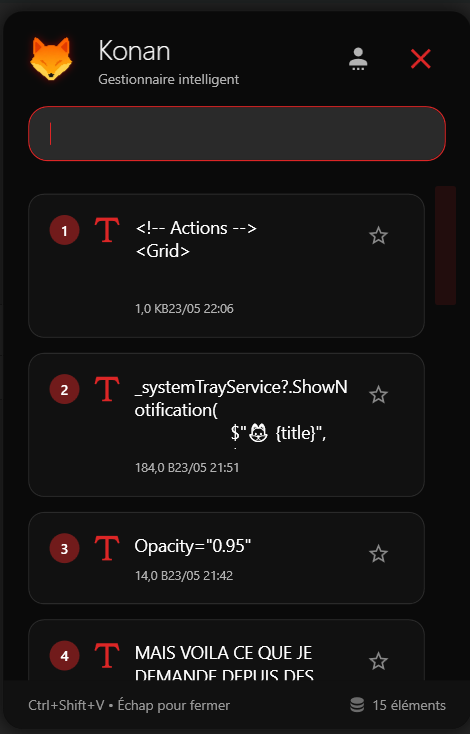
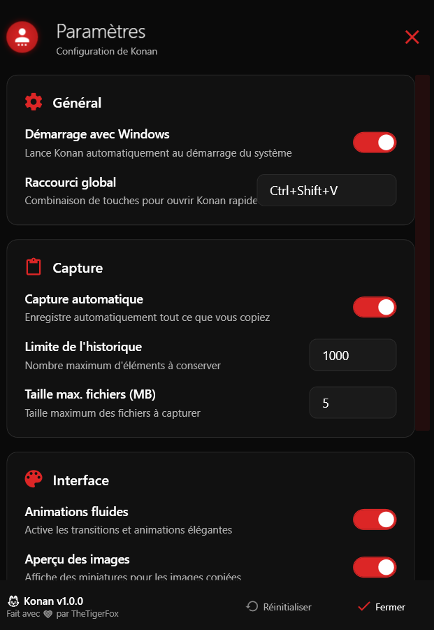

<div align="center">
  

# 🦊 Konan

**Gestionnaire de Presse-Papiers Intelligent et Moderne**

*Inspiré par Konan de l'Akatsuki, maîtresse du papier - Konan maîtrise votre presse-papiers*

[](https://dotnet.microsoft.com/download/dotnet/8.0)
[](https://docs.microsoft.com/en-us/dotnet/desktop/wpf/)
[](LICENSE)
[](https://github.com/Tiger-foxx)

  
</div>

---

## 📋 Table des Matières

- [🌟 Aperçu](#-aperçu)
- [✨ Fonctionnalités](#-fonctionnalités)
- [🏆 Pourquoi Konan vs Windows natif](#-pourquoi-konan-vs-windows-natif)
- [🖼️ Captures d'écran](#️-captures-décran)
- [🚀 Installation](#-installation)
- [⚡ Utilisation](#-utilisation)
- [⚙️ Configuration](#️-configuration)
- [🔧 Architecture Technique](#-architecture-technique)
- [🎨 Design et UX](#-design-et-ux)
- [📦 Dépendances](#-dépendances)
- [🛠️ Développement](#️-développement)
- [📄 License](#-license)
- [👤 Auteur](#-auteur)

---

## 🌟 Aperçu

**Konan** est un gestionnaire de presse-papiers nouvelle génération pour Windows, développé en WPF avec .NET 8. Inspiré par Konan de l'Akatsuki, maîtresse du papier, cette application révolutionne votre façon de gérer et d'utiliser votre presse-papiers.

### 🎯 Mission
Transformer une tâche quotidienne en une expérience fluide, élégante et productive. Konan capture, organise et vous permet de réutiliser instantanément tout ce que vous copiez.

---

## ✨ Fonctionnalités

### 🔥 Fonctionnalités Principales

#### 📝 **Gestion Intelligente**
- ✅ **Capture automatique** de tous vos contenus copiés
- ✅ **Historique persistant** conservé entre les sessions
- ✅ **Types multiples** : Texte, Rich Text, Images, Fichiers
- ✅ **Recherche en temps réel** dans tout l'historique
- ✅ **Système de favoris** pour vos contenus importants

#### ⚡ **Performance et Productivité**
- ✅ **Raccourcis clavier** : `Ctrl+Shift+V` (configurable)
- ✅ **Sélection rapide** : Touches 1-9 pour accès instantané
- ✅ **Collage automatique** : Konan colle directement après sélection
- ✅ **Prévisualisation** riche avec métadonnées complètes
- ✅ **Système de notifications** Windows 10/11

#### 🎨 **Interface Moderne**
- ✅ **Design noir/rouge** épuré et professionnel
- ✅ **Animations fluides** avec Material Design
- ✅ **Fenêtre transparente** avec effets glassmorphiques
- ✅ **Scrollbar ultra-fine** discrète
- ✅ **Responsive** et adaptatif

#### ⚙️ **Configuration Avancée**
- ✅ **Démarrage automatique** avec Windows
- ✅ **Limites personnalisables** d'historique et de taille
- ✅ **Nettoyage automatique** programmable
- ✅ **Export/Import** de l'historique
- ✅ **Paramètres persistants** en JSON

---

## 🏆 Pourquoi Konan vs Windows natif

### ❌ **Limitations de Windows 11 natif (`Win+V`)**

| Aspect | Windows Natif | 🦊 Konan |
|--------|---------------|----------|
| **Historique** | 25 éléments max | **Jusqu'à 1000+** configurable |
| **Recherche** | ❌ Aucune | ✅ **Recherche instantanée** |
| **Types de contenu** | Limité | ✅ **Tous types** + métadonnées |
| **Persistance** | Session uniquement | ✅ **Sauvegarde permanente** |
| **Favoris** | ❌ Non | ✅ **Système complet** |
| **Personnalisation** | ❌ Aucune | ✅ **Configuration complète** |
| **Interface** | Basique | ✅ **Design moderne** |
| **Raccourcis** | Win+V seulement | ✅ **Raccourcis personnalisés** |
| **Sélection rapide** | ❌ Non | ✅ **Touches 1-9** |
| **Notifications** | Basique | ✅ **Notifications intelligentes** |
| **Performance** | Lente au chargement | ✅ **Instantané** |

### 🚀 **Avantages exclusifs de Konan**

#### 💡 **Productivité Maximale**
- **Workflow optimisé** : Ouvrir → Rechercher → Sélectionner → Coller en moins de 2 secondes
- **Mémoire étendue** : Retrouvez un texte copié il y a des semaines
- **Intelligence contextuelle** : Métadonnées automatiques (date, taille, fréquence d'usage)

#### 🎯 **Expérience Utilisateur Supérieure**
- **Design cohérent** avec les applications modernes
- **Animations fluides** qui rendent l'utilisation agréable
- **Feedback visuel** constant sur vos actions

#### 🔧 **Contrôle Total**
- **Personnalisation complète** de tous les aspects
- **Données locales** : Vos données restent sur votre machine
- **Open source** : Transparence et évolutivité

---

## 🖼️ Captures d'écran

<div align="center">

### Interface Principale


*Interface principale avec historique, recherche et sélection rapide*

### Fenêtre de Configuration


*Panneau de configuration complet et intuitif*

</div>

---

## 🚀 Installation

### 📋 Prérequis
- **Windows 10/11** (x64)
- **.NET 8 Runtime** ([Télécharger](https://dotnet.microsoft.com/download/dotnet/8.0))

### 💾 Installation

#### Option 1 : Release GitHub (Recommandé)
```bash
# Téléchargez la dernière release
wget https://github.com/theTigerFox/Konan/releases/latest/download/Konan.zip

# Extraire et lancer
unzip Konan.zip
cd Konan
./Konan.exe
```

#### Option 2 : Compilation depuis les sources
```bash
# Cloner le repository
git clone https://github.com/theTigerFox/Konan.git
cd Konan

# Restaurer les dépendances
dotnet restore

# Compiler et lancer
dotnet run
```

### 🔧 Configuration initiale
1. **Premier lancement** : Konan se configure automatiquement
2. **Raccourci global** : `Ctrl+Shift+V` (modifiable dans les paramètres)
3. **Démarrage automatique** : Optionnel, configurable dans les paramètres

---

## ⚡ Utilisation

### 🚀 Démarrage Rapide

1. **Lancer Konan** : L'application se place dans la barre des tâches
2. **Copier du contenu** : Utilisez `Ctrl+C` normalement
3. **Ouvrir l'historique** : `Ctrl+Shift+V`
4. **Sélectionner** : Cliquez ou utilisez les touches 1-9
5. **C'est collé !** : Konan colle automatiquement

### ⌨️ Raccourcis Clavier

| Raccourci | Action |
|-----------|--------|
| `Ctrl+Shift+V` | Ouvrir Konan |
| `Échap` | Fermer Konan |
| `Entrée` | Coller le premier élément filtré |
| `1-9` | Sélection rapide des 9 premiers éléments |
| `Ctrl+F` | Focus sur la recherche |

### 🔍 Recherche Avancée

```
# Recherche simple
texte à trouver

# Recherche par type
type:image
type:fichier
type:texte

# Recherche par date
aujourd'hui
hier
cette semaine
```

### ⭐ Système de Favoris

- **Ajouter aux favoris** : Clic droit → "Ajouter aux favoris"
- **Accès rapide** : Les favoris apparaissent en premier
- **Persistance** : Les favoris sont sauvegardés automatiquement

---

## ⚙️ Configuration

### 🎛️ Paramètres Principaux

#### **Général**
- **Démarrage automatique** : Lance Konan avec Windows
- **Raccourci global** : Personnalisez la combinaison de touches
- **Thème** : Choix des couleurs d'interface

#### **Capture**
- **Capture automatique** : Surveille automatiquement le presse-papiers
- **Limite d'historique** : Nombre maximum d'éléments (10-1000+)
- **Taille maximale** : Limite pour les fichiers volumineux
- **Types exclus** : Filtres par type de contenu

#### **Interface**
- **Animations** : Active/désactive les transitions
- **Aperçu images** : Miniatures pour les images
- **Opacité** : Transparence de la fenêtre
- **Position** : Emplacement d'ouverture

#### **Nettoyage**
- **Nettoyage automatique** : Suppression des anciens éléments
- **Fréquence** : Intervalle de nettoyage
- **Conservation favoris** : Les favoris sont toujours conservés

### 📁 Fichiers de Configuration

```
%APPDATA%/Konan/
├── settings.json          # Configuration principale
├── clipboard_history.json # Historique du presse-papiers
├── favorites.json         # Éléments favoris
└── logs/                  # Journaux d'application
```

---

## 🔧 Architecture Technique

### 🏗️ Structure du Projet

```
Konan/
├── 📁 Assets/
│   ├── 🖼️ Images/         # Ressources visuelles
│   └── 🎵 Sounds/         # Sons système
├── 📁 Models/             # Modèles de données
│   ├── ClipboardItem.cs   # Élément du presse-papiers
│   └── Settings.cs        # Configuration
├── 📁 Services/           # Logique métier
│   ├── ClipboardService.cs     # Gestion presse-papiers
│   ├── SearchService.cs        # Moteur de recherche
│   ├── SettingsService.cs      # Configuration
│   ├── HotkeyService.cs        # Raccourcis globaux
│   └── NotificationService.cs  # Notifications
├── 📁 Views/              # Interfaces utilisateur
│   ├── MainWindow.xaml         # Fenêtre principale
│   ├── SettingsWindow.xaml     # Configuration
│   └── Styles/                 # Styles et thèmes
└── 📄 App.xaml           # Point d'entrée application
```

### 🔌 Services et Injection de Dépendances

```csharp
// Configuration des services
services.AddSingleton<ClipboardService>();
services.AddSingleton<SearchService>();
services.AddSingleton<SettingsService>();
services.AddSingleton<HotkeyService>();
services.AddSingleton<NotificationService>();
services.AddSingleton<SystemTrayService>();
```

### 🎯 Patterns Utilisés

- **MVVM** : Séparation claire des responsabilités
- **Dependency Injection** : Services découplés et testables
- **Observer Pattern** : Communication entre services
- **Strategy Pattern** : Différents types de contenu
- **Repository Pattern** : Gestion des données

### 🔒 Sécurité et Performance

- **Données locales** : Aucune donnée envoyée sur internet
- **Chiffrement** : Données sensibles chiffrées localement
- **Optimisation mémoire** : Gestion intelligente du cache
- **Threading** : Operations asynchrones pour la fluidité

---

## 🎨 Design et UX

### 🎨 Philosophie Design

**Konan** suit une philosophie de design moderne basée sur :

#### **Minimalisme Élégant**
- Interface épurée focalisée sur l'essentiel
- Couleurs noir/rouge pour un contraste optimal
- Espacement généreux pour la lisibilité

#### **Material Design Moderne**
- Animations fluides et naturelles
- Effets d'élévation et d'ombres
- Feedback visuel immédiat

#### **Accessibilité**
- Contraste élevé pour tous les utilisateurs
- Navigation clavier complète
- Tailles de police adaptatives

### 🎭 Système de Couleurs

```scss
// Palette principale
$primary-black: #0a0a0a;     // Fond principal
$secondary-black: #111111;    // Cartes et éléments
$border-gray: #2a2a2a;       // Bordures subtiles
$accent-red: #dc2626;        // Accents et interactions
$text-white: #ffffff;        // Texte principal
$text-muted: #80ffffff;      // Texte secondaire
```

### ✨ Animations et Transitions

- **Fade In/Out** : Apparition/disparition des fenêtres
- **Scale Transform** : Effet de zoom sur les interactions
- **Color Transitions** : Changements de couleur fluides
- **BackEase** : Animations avec rebond naturel

---

## 📦 Dépendances

### 🔧 Packages NuGet

```xml
<!-- Core Framework -->
<PackageReference Include="Microsoft.Extensions.DependencyInjection" Version="8.0.0" />
<PackageReference Include="Microsoft.Extensions.Hosting" Version="8.0.0" />
<PackageReference Include="Microsoft.Extensions.Logging" Version="8.0.0" />

<!-- UI et Design -->
<PackageReference Include="MaterialDesignThemes" Version="4.9.0" />
<PackageReference Include="MaterialDesignColors" Version="2.1.4" />
<PackageReference Include="MahApps.Metro.IconPacks.Material" Version="4.11.0" />

<!-- Fonctionnalités Système -->
<PackageReference Include="Hardcodet.NotifyIcon.Wpf" Version="1.1.0" />
<PackageReference Include="Microsoft.Win32.Registry" Version="5.0.0" />
<PackageReference Include="System.Drawing.Common" Version="8.0.0" />

<!-- Sérialisation -->
<PackageReference Include="Newtonsoft.Json" Version="13.0.3" />
```

### 🎯 Justification des Choix

- **MaterialDesign** : Composants modernes et animations
- **MahApps.IconPacks** : Icônes Material Design cohérentes
- **Hardcodet.NotifyIcon** : Intégration barre des tâches
- **Newtonsoft.Json** : Sérialisation robuste des données

---

## 🛠️ Développement

### 🚀 Environnement de Développement

```bash
# Prérequis
- Visual Studio 2022 ou VS Code
- .NET 8 SDK
- Windows 10/11

# Setup du projet
git clone https://github.com/theTigerFox/Konan.git
cd Konan
dotnet restore
dotnet build
```

### 🧪 Tests et Qualité

```bash
# Tests unitaires
dotnet test

# Analyse statique
dotnet format
dotnet analyze

# Build release
dotnet publish -c Release -r win-x64 --self-contained
```

### 📋 Standards de Code

- **C# 12** avec nullable reference types
- **XAML** avec binding et commandes
- **Async/await** pour toutes les opérations I/O
- **Logging** structuré avec ILogger
- **Comments** XML pour la documentation

### 🔄 Workflow de Contribution

1. **Fork** le repository
2. **Branch** : `feature/nouvelle-fonctionnalite`
3. **Commit** : Messages descriptifs
4. **Tests** : Vérifiez que tout fonctionne
5. **Pull Request** : Description détaillée

---

## 📄 License

Ce projet est sous licence **MIT**. Voir le fichier [LICENSE](LICENSE) pour plus de détails.

```
MIT License

Copyright (c) 2024 Fox

Permission is hereby granted, free of charge, to any person obtaining a copy
of this software and associated documentation files (the "Software"), to deal
in the Software without restriction, including without limitation the rights
to use, copy, modify, merge, publish, distribute, sublicense, and/or sell
copies of the Software, and to permit persons to whom the Software is
furnished to do so, subject to the following conditions:

The above copyright notice and this permission notice shall be included in all
copies or substantial portions of the Software.

THE SOFTWARE IS PROVIDED "AS IS", WITHOUT WARRANTY OF ANY KIND, EXPRESS OR
IMPLIED, INCLUDING BUT NOT LIMITED TO THE WARRANTIES OF MERCHANTABILITY,
FITNESS FOR A PARTICULAR PURPOSE AND NONINFRINGEMENT.
```

---

## 👤 Auteur

<div align="center">

**🦊 Fox** *(theTigerFox)*

*Développeur passionné, créateur d'outils qui simplifient la vie*

[](donfackarthur750@gmail.com)

</div>

### 💭 Inspiration

Ce projet est inspiré par **Konan de l'Akatsuki**, maîtresse du papier dans l'univers Naruto. Tout comme elle manipule le papier avec grâce et précision, Konan l'application vous donne un contrôle total sur votre presse-papiers numérique.

---

<div align="center">

### 🙏 Remerciements

Merci à tous les contributeurs et utilisateurs qui font de Konan un outil toujours plus performant !

**⭐ Si Konan vous aide au quotidien, n'hésitez pas à laisser une étoile !**


</div>